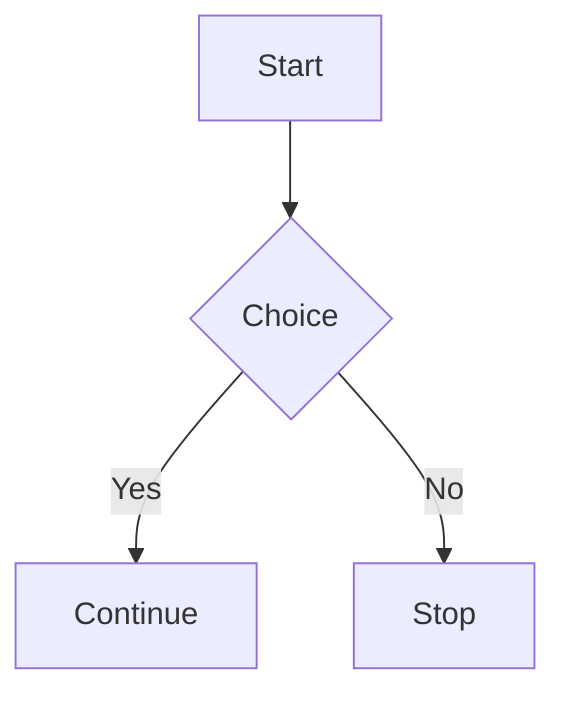

# honkit-plugin-mermaid-configurable

A configurable Mermaid plugin for **Honkit** that lets you render diagrams with custom global or inline options.

## ⚙️ Installation

```bash
npm install --save @tecknition/honkit-plugin-mermaid-configurable mermaid
```

Then add to your `book.json` (or Honkit config):

```json
{
  "plugins": ["mermaid-configurable"],
  "pluginsConfig": {
    "mermaid-configurable": {
      "theme": "dark",
      "fontFamily": "Fira Code, monospace",
      "securityLevel": "loose"
    }
  }
}
```

## ✍️ Usage

````markdown

````

Inline overrides:

````markdown

sequenceDiagram
  participant User
  participant Server
  User->>Server: Request
  Server-->>User: Response

````

## 🔧 Options

| Option | Type | Default | Description |
|--------|------|----------|-------------|
| `theme` | string | `"default"` | Mermaid theme |
| `securityLevel` | string | `"strict"` | Security level |
| `fontFamily` | string | `"Arial, sans-serif"` | Font family |
| `fontSize` | string | `"16px"` | Font size |
| `startOnLoad` | boolean | `false` | Auto-start rendering |
